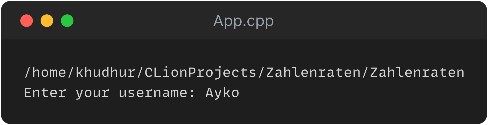
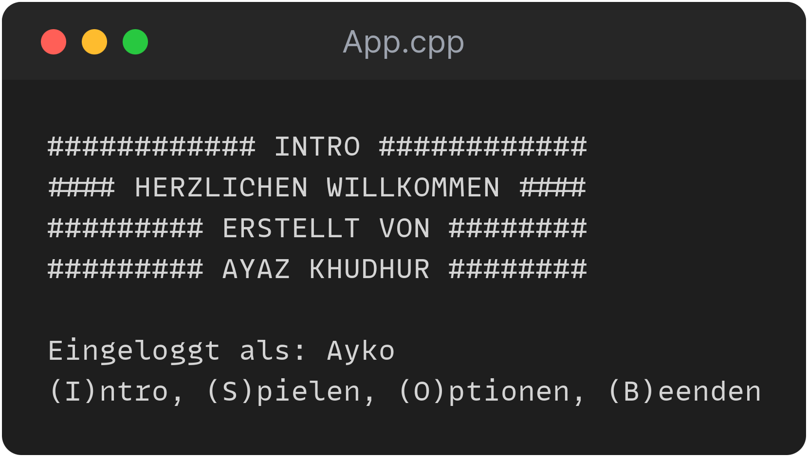
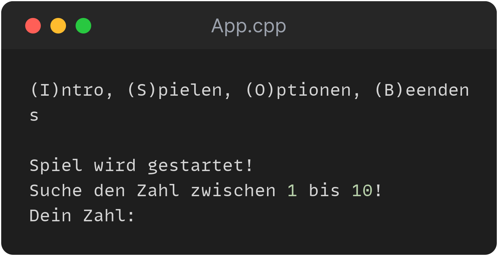
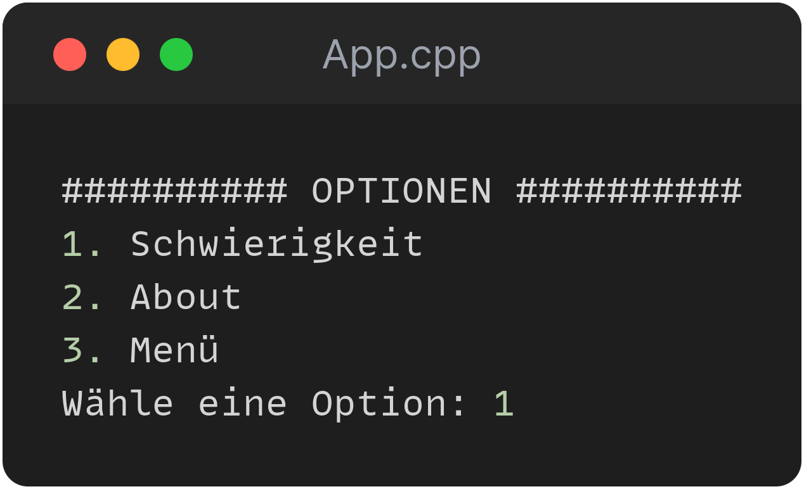
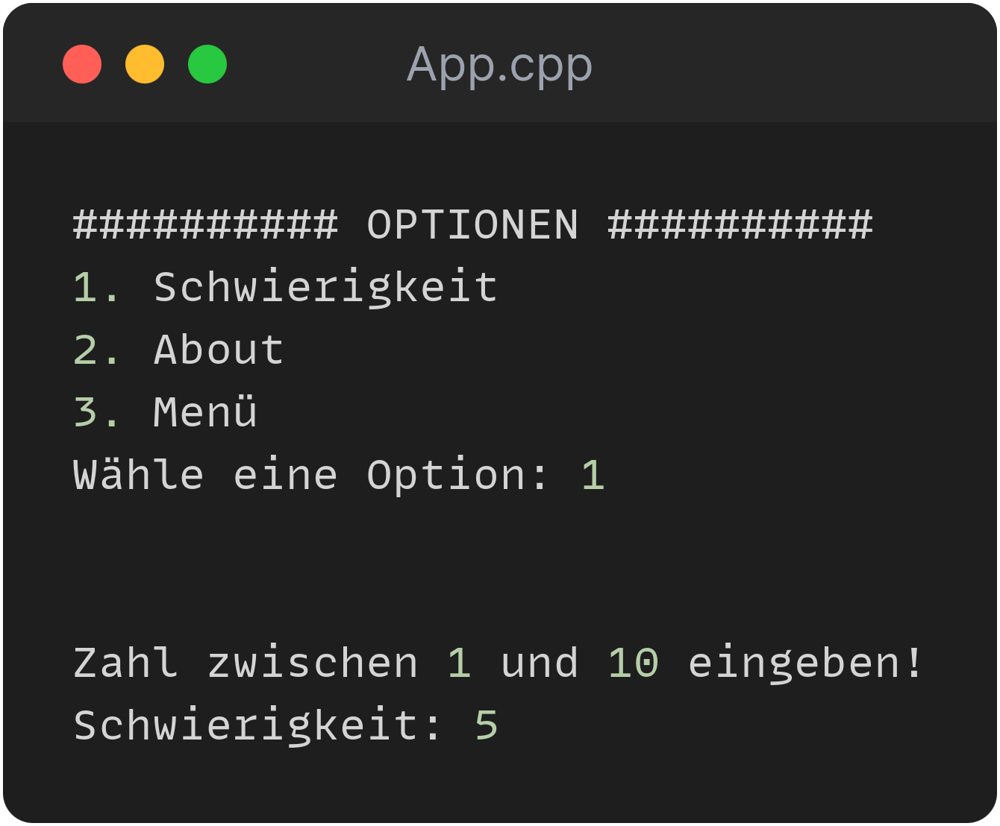

# C++ lernen mit: C++ für Spieleprogrammierer

## Projekt: Zahlenraten in C++
Ein einfaches Projekt, bei dem der Benutzer eine Zahl erraten soll. Es gibt die Möglichkeit, den Schwierigkeitsgrad des Spiels zu bestimmen, jedoch nur bis Level 10. Das bedeutet, dass Zahlen zwischen 1 und 100 geraten werden können.

## Projekt klonen
+ `git clone https://github.com/khudhurayaz/CPP_Zahlenraten.git`

## Ausführbare Datei herunterladen
+ Laden Sie die Datei [hier](App) herunter.

## Spiel unter Windows starten
+ Doppelklicken Sie auf die App.exe-Datei.

## Spiel unter Ubuntu starten
+ Laden Sie die `.out`-Datei [hier](App.out) herunter.
+ Starten Sie Ihr Terminal.
+ Navigieren Sie zum Zahlenraten-Ordner oder zur heruntergeladenen `.out`-Datei..
+ Rechtsklick -> Eigenschaften -> Als Programm ausführbar -> Aktivieren
+ Mit dem Befehl `./App` können Sie das Spiel starten.

## Spielstart

## Menü

## Das Spielfeld

## Optionen

## Schwierigkeit der Level ändern

